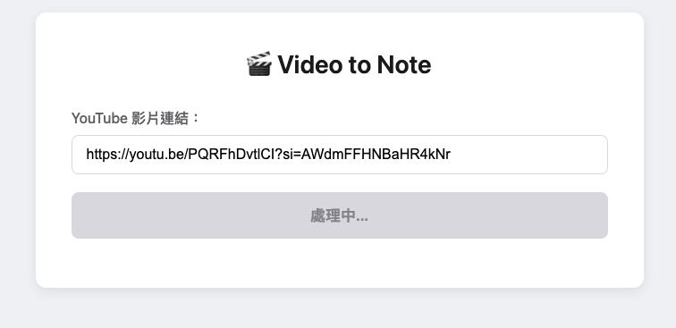

# Video to Note - YouTube 影片轉錄與筆記生成工具

這是一個 Python 專案，可以自動從 YouTube 影片或本地音檔生成逐字稿和 AI 筆記。它整合了 `yt-dlp`、`Whisper` 模型以及大型語言模型（OpenAI 或 DeepSeek），提供從下載、轉錄到生成筆記的完整自動化流程。

專案同時提供簡單易用的 Web 介面和功能強大的命令列工具（CLI）。

## ✨ 主要功能

- **支援多種輸入來源**：可處理 YouTube 影片、本地音檔，並支援批次處理多個 YouTube 連結。
- **高品質語音轉錄**：使用 OpenAI 的 `whisper-large-v3` 模型進行語音辨識，確保高準確度。
- **AI 自動筆記**：串接大型語言模型（可選 OpenAI 或 DeepSeek），將逐字稿自動整理成結構化的筆記。
- **雙介面支援**：提供直觀的 Web 介面，方便快速使用；也提供功能完整的命令列工具，適合進階使用者和自動化腳本。
- **彈性化設定**：可透過環境變數或命令列參數輕鬆設定 API 金鑰。
- **資源管理**：可選擇在處理完成後自動刪除下載的音檔，節省儲存空間。

## ⚙️ 環境準備

在開始之前，請確保您已安裝以下軟體：

- [Python 3.8+](https://www.python.org/)
- [FFmpeg](https://ffmpeg.org/download.html)：`Whisper` 模型處理音訊時需要此工具。

您還需要至少一個 API 金鑰：

- [OpenAI API Key](https://platform.openai.com/api-keys)
- [DeepSeek API Key](https://platform.deepseek.com/)

## 🚀 安裝步驟

1.  **複製專案**

    ```bash
    git clone https://github.com/your-username/videoToNote.git
    cd videoToNote
    ```

2.  **安裝必要的 Python 套件**

    ```bash
    pip install -r requirements.txt
    ```

## 🛠️ 環境設定

專案透過環境變數來管理 API 金鑰，這是最推薦的設定方式。

1.  **建立 `.env` 檔案**

    在專案的根目錄下建立一個名為 `.env` 的檔案。

2.  **設定 API 金鑰**

    在 `.env` 檔案中加入您的 API 金鑰。您只需要提供其中一個即可。

    ```env
    OPENAI_API_KEY="sk-YourOpenAIKey"
    DEEPSEEK_API_KEY="sk-YourDeepSeekKey"
    ```

    專案會自動讀取此檔案來載入您的金鑰。

## ▶️ 使用方式

您可以透過 Web 介面或命令列工具來使用本專案。

### 🌐 Web 介面

Web 介面提供了一個簡單的頁面，讓您貼上 YouTube 連結即可開始生成逐字稿和筆記。



1.  **啟動 Flask 應用**

    ```bash
    python app.py
    ```

2.  **開啟瀏覽器**

    在瀏覽器中開啟 `http://127.0.0.1:5000`，您會看到操作介面。

3.  **貼上連結並生成**

    將 YouTube 影片連結貼到輸入框中，點擊「開始生成」，稍待片刻即可在下方看到結果。

### ⌨️ 命令列介面 (CLI)

命令列工具提供更豐富的功能，適合批次處理或整合到自動化流程中。

**基本指令格式**：

```bash
python cli.py [輸入來源] [選項]
```

**範例**：

-   **處理單一 YouTube 影片**：

    ```bash
    python cli.py -y "https://www.youtube.com/watch?v=your_video_id"
    ```

-   **處理本地音檔**：

    ```bash
    python cli.py -a "path/to/your/audio.mp3"
    ```

-   **批次處理多個 YouTube 影片**：

    ```bash
    python cli.py -b "https://youtu.be/video1" "https://youtu.be/video2"
    ```

-   **處理完畢後保留音檔**：

    預設會刪除下載的 MP3 檔案，若要保留，請加上 `--keep-audio` 旗標。

    ```bash
    python cli.py -y "https://youtu.be/video1" --keep-audio
    ```

-   **從命令列指定 API Key**：

    如果您不想使用環境變數，也可以直接在指令中提供金鑰。

    ```bash
    python cli.py -y "https://youtu.be/video1" --openai-key "sk-YourKey"
    # 或者
    python cli.py -y "https://youtu.be/video1" --deepseek-key "sk-YourKey"
    ```

## 📂 專案結構

```
videoToNote/
├── mp3/                  # 存放下載的 MP3 音檔
├── 逐字稿/               # 存放生成的逐字稿文字檔
├── 筆記/                 # 存放 AI 生成的筆記文字檔
├── tools/                # 核心工具模組
│   ├── downloader.py     # YouTube 影片下載器
│   ├── transcriber.py    # 語音轉錄器
│   └── notes_generator.py # 筆記生成器
├── templates/
│   └── index.html        # Web 介面的 HTML 範本
├── app.py                # Flask Web 應用程式
├── cli.py                # 命令列介面主程式
├── processor.py          # 整合下載、轉錄和筆記生成的主要邏輯
├── config.py             # 專案設定檔
├── requirements.txt      # Python 套件依賴列表
└── README.md             # 專案說明文件
```

## 📝 未來開發計畫 (TODO)

- [ ] **整合 Google Gemini 模型**：新增一個選項，讓使用者可以選擇使用 Gemini Pro 來生成筆記。
- [ ] **支援本地大型語言模型 (Local LLM)**：研究並整合開源的本地模型（例如 Llama、Ollama），讓使用者可以在沒有網路或不想使用雲端服務的情況下生成筆記。
