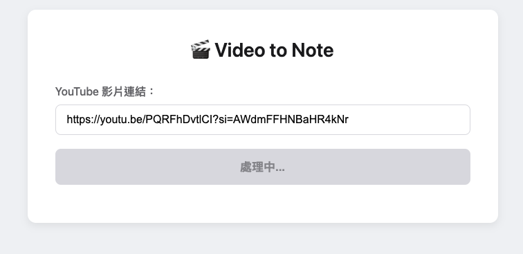

# 🎬 VideoToNote

<div align="center">



**智能影片轉錄與筆記生成工具**

[](https://www.python.org/)
[](https://flask.palletsprojects.com/)
[](LICENSE)
[](https://github.com/a227799770055/VideoToNote/graphs/commit-activity)

*將 YouTube 影片智能轉換為結構化筆記的一站式解決方案*

</div>

---

## 🌟 核心特色

### 🚀 多模態處理能力
- **YouTube 影片下載**: 使用 yt-dlp 自動下載高品質音檔
- **本地音檔支援**: 支援 MP3、WAV、M4A、FLAC 等格式
- **批次處理**: 同時處理多個影片，提升工作效率

### 🧠 AI 驅動的智能轉換
- **高精度語音轉錄**: 基於 OpenAI Whisper 大模型
- **多語言支援**: 中文、英文等多種語言識別
- **時間戳記**: 精確的時間軸對應

### 📝 智能筆記生成
支援多種 AI 模型，滿足不同需求：

| 模型 | 特色 | 適用場景 |
|------|------|----------|
| **OpenAI GPT-4o-mini** | 高品質、結構化 | 專業會議、學術講座 |
| **DeepSeek** | 性價比優秀 | 日常學習、內容整理 |
| **Google Gemini** | 多模態理解 | 複雜內容分析 |
| **Ollama (本地)** | 隱私安全、免費 | 敏感內容、離線使用 |

### 🖥️ 雙重使用介面
- **命令列工具 (CLI)**: 自動化處理、腳本整合
- **Web 介面**: 直觀易用、拖拽上傳

---

## 🏗️ 專案架構

重構後的模組化設計，清晰易維護：

```
videoToNote/
├── 🚀 main.py                    # 統一入口點
├── 📦 setup.py                   # 安裝配置
├── 🎨 video_processor_gui.py     # GUI 介面
│
├── 📁 src/                       # 核心源碼
│   ├── 🧠 core/                  # 核心邏輯
│   │   ├── config.py             # 統一配置管理
│   │   └── processor.py          # 主處理流程
│   │
│   ├── 🔧 services/              # 業務服務
│   │   ├── downloader.py         # YouTube 下載
│   │   ├── transcriber.py        # 語音轉錄
│   │   └── notes_generator.py    # 筆記生成
│   │
│   ├── 🖥️ interfaces/            # 使用者介面
│   │   ├── cli.py               # 命令列介面
│   │   └── web/                 # Web 服務
│   │       ├── app.py           # Flask 應用
│   │       └── templates/       # 前端模板
│   │
│   └── 🛠️ utils/                 # 工具函式
│       └── file_manager.py      # 檔案管理
│
├── 📊 data/                      # 資料存放
│   ├── mp3/                     # 音檔
│   ├── transcriptions/          # 轉錄文字
│   └── notes/                   # 生成筆記
│
├── 🧪 tests/                     # 測試程式
├── 📜 scripts/                   # 獨立腳本
├── � requirements/              # 依賴管理
└── 📚 docs/                      # 專案文件
```

---

## ⚡ 快速開始

### 環境準備

```bash
# 1. 複製專案
git clone https://github.com/a227799770055/VideoToNote.git
cd VideoToNote

# 2. 建立虛擬環境
conda create -n video2note python=3.11
conda activate video2note

# 3. 安裝依賴
pip install -r requirements/base.txt

# 4. 安裝系統依賴
# macOS
brew install yt-dlp
# Ubuntu/Debian
sudo apt install yt-dlp
```

### 配置 API 金鑰

```bash
# 複製環境變數範本
cp .env.example .env

# 編輯 .env 檔案，填入您的 API 金鑰
# OPENAI_API_KEY=sk-your-openai-key
# DEEPSEEK_API_KEY=sk-your-deepseek-key
# GEMINI_API_KEY=your-gemini-key
```

---

## 📖 使用指南

### 🖥️ 命令列介面

#### 基本使用

```bash
# 處理 YouTube 影片
python main.py --youtube "https://www.youtube.com/watch?v=dQw4w9WgXcQ"

# 處理本地音檔
python main.py --audio "path/to/your/audio.mp3"

# 指定 AI 模型
python main.py --youtube "https://youtu.be/xyz" --model deepseek

# 保留音檔
python main.py --youtube "https://youtu.be/xyz" --keep-audio
```

#### 批次處理

```bash
# 批次處理多個影片
python main.py --batch \
  "https://youtu.be/video1" \
  "https://youtu.be/video2" \
  "https://youtu.be/video3"
```

#### 高級選項

```bash
# 完整命令範例
python main.py \
  --youtube "https://youtu.be/xyz" \
  --model gemini \
  --api-key "your-custom-key" \
  --keep-audio \
  --language chinese
```

### 🌐 Web 介面

```bash
# 啟動 Web 服務
python main.py web
```

然後在瀏覽器開啟 `http://localhost:5001`

**Web 介面功能**：
- 🎯 直觀的拖拽上傳
- 🔄 即時處理進度
- 📊 模型選擇介面
- 📥 結果下載

### 🔧 獨立腳本

```bash
# 僅進行語音轉錄
python scripts/transcribe_audio.py "audio.mp3"

# 從逐字稿生成筆記
python scripts/generate_note.py "transcription.txt" openai
```

---

## ⚙️ 配置說明

### 環境變數

| 變數名稱 | 說明 | 必填 |
|---------|------|------|
| `OPENAI_API_KEY` | OpenAI API 金鑰 | 使用 OpenAI 時 |
| `DEEPSEEK_API_KEY` | DeepSeek API 金鑰 | 使用 DeepSeek 時 |
| `GEMINI_API_KEY` | Google Gemini API 金鑰 | 使用 Gemini 時 |
| `OLLAMA_API_URL` | Ollama 服務 URL | 使用 Ollama 時 |

### 模型設定

在 `src/core/config.py` 中可自訂：

```python
# 預設模型設定
WHISPER_MODEL_ID = "openai/whisper-large-v3"
OPENAI_MODEL = "gpt-4o-mini"
DEEPSEEK_MODEL = "deepseek-chat"
GEMINI_MODEL = "gemini-1.5-flash"

# 自訂提示詞
DEFAULT_PROMPT = "這是一場演講的逐字稿，請你幫我整理成6000字的筆記"
```

---

## 🔄 使用場景

### 📚 學習場景
- **線上課程筆記**: 將教學影片轉為詳細筆記
- **會議記錄**: 自動生成會議摘要和行動項目
- **研究資料**: 從訪談或演講中提取關鍵資訊

### 💼 商業應用
- **培訓材料**: 將培訓影片轉為文字教材
- **客戶訪談**: 快速整理用戶反饋
- **競品分析**: 分析競爭對手的公開演講

### 🎥 內容創作
- **影片字幕**: 自動生成精準字幕
- **部落格文章**: 將影片內容轉為文章
- **社群媒體**: 從長影片提取重點片段

---

## 🛠️ 開發指南

### 本地開發

```bash
# 安裝開發依賴
pip install -r requirements/dev.txt

# 運行測試
python -m unittest discover tests

# 程式碼格式化
black src/
flake8 src/
```

### 擴展功能

專案採用模組化設計，易於擴展：

```python
# 新增 AI 模型
class CustomAIService:
    def generate_notes(self, transcription):
        # 實作您的 AI 邏輯
        pass

# 新增下載來源
class CustomDownloader:
    def download_audio(self, url):
        # 實作您的下載邏輯
        pass
```

### 部署

```bash
# 使用 Docker
docker build -t videotonote .
docker run -p 5001:5001 videotonote

# 使用 Gunicorn
pip install gunicorn
gunicorn -w 4 -b 0.0.0.0:5001 "src.interfaces.web.app:app"
```

---

## 📊 效能說明

| 功能 | 處理速度 | 記憶體使用 |
|------|---------|----------|
| YouTube 下載 | ~2x 播放速度 | 低 |
| 語音轉錄 | ~0.5x 播放速度 | 中等 (GPU 加速) |
| 筆記生成 | ~10 秒/千字 | 低 |

**建議硬體需求**：
- CPU: 4+ 核心
- RAM: 8GB+ (16GB 推薦)
- GPU: 可選，加速語音轉錄
- 儲存: 10GB+ 可用空間

---

## 🤝 貢獻指南

我們歡迎所有形式的貢獻！

### 報告問題

請使用 [GitHub Issues](https://github.com/a227799770055/VideoToNote/issues) 報告：
- 🐛 Bug 報告
- 💡 功能建議
- 📖 文件改善

### 提交代碼

1. **Fork** 專案
2. 創建功能分支: `git checkout -b feature/amazing-feature`
3. 提交變更: `git commit -m 'Add amazing feature'`
4. 推送分支: `git push origin feature/amazing-feature`
5. 開啟 **Pull Request**

### 開發原則

- 📝 清晰的程式碼註釋
- 🧪 完整的單元測試
- 📚 詳細的文件說明
- 🎨 遵循 PEP 8 風格指南

---

## 📜 版本記錄

### v1.0.0 (2025-09-09)
- 🎉 完整重構專案架構
- ✨ 新增模組化設計
- 🌐 改善 Web 介面
- 🔧 統一配置管理
- 📊 新增批次處理
- 🧪 完整測試覆蓋

### 舊版本記錄
詳見 [MIGRATION_GUIDE.md](MIGRATION_GUIDE.md)

---

## 🙏 致謝

特別感謝以下開源專案：

- **[OpenAI Whisper](https://github.com/openai/whisper)** - 高品質語音識別
- **[yt-dlp](https://github.com/yt-dlp/yt-dlp)** - YouTube 影片下載
- **[Transformers](https://huggingface.co/transformers/)** - 機器學習框架
- **[Flask](https://flask.palletsprojects.com/)** - Web 應用框架

---

## 📄 授權條款

本專案使用 [MIT License](LICENSE)

---

## 📞 聯絡我們

<div align="center">

[](https://github.com/a227799770055/VideoToNote)
[](https://github.com/a227799770055/VideoToNote/issues)
[](https://github.com/a227799770055/VideoToNote/discussions)

**如果這個專案對您有幫助，請給我們一個 ⭐ Star！**

</div>
